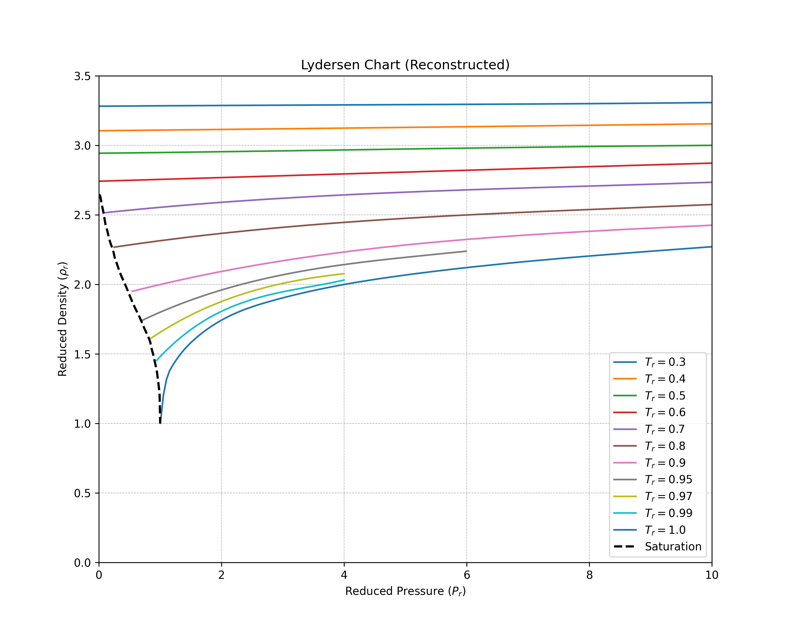
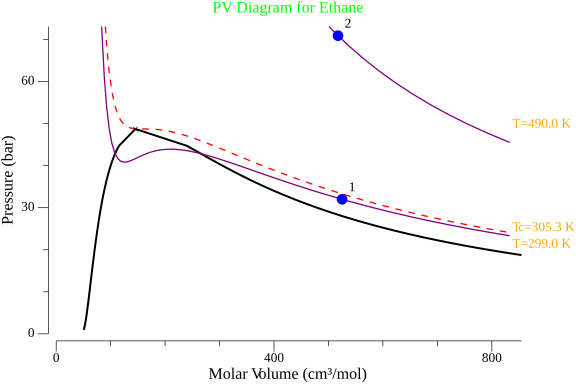

# zfactor

`zfactor` is a comprehensive Go library designed for thermodynamic property calculations and visualization. It provides tools for solving Cubic Equations of State (EOS), estimating properties using correlations like Lee-Kesler, and generating Pressure-Volume (PV) diagrams.

## Features

- **Cubic Equations of State (EOS)**: Support for major cubic EOS models:
  - van der Waals (vdW)
  - Redlich-Kwong (RK)
  - Soave-Redlich-Kwong (SRK)
  - Peng-Robinson (PR)
- **Lee-Kesler Correlation**: Accurate estimation of compressibility factors (Z) and other derived properties.
- **Virial Equations**: Solvers for 2-term and 3-term virial equations of state.
- **Liquid Properties**: Calculation of saturated liquid molar volumes using the Rackett equation and reduced density using Lydersen charts.
- **Antoine Equation**: Calculation of saturation vapor pressures.
- **Thermodynamic State Management**: Easy definition and validation of states ($T, P$).
- **Visualization**: Built-in generation of PV diagrams with:
  - Critical Isotherms
  - Saturation Domes (Two-phase regions)
  - Custom Isotherms
  - Customizable styling (colors, labels, dimensions)
- **Substance Database**: Pre-defined properties for common substances (Critical properties, Acentric factor, MW, etc.).

## Important Note on Lydersen Charts

The `ReducedDensity` function relies on digitized data from the Lydersen charts. While efforts have been made to ensure accuracy through smoothing and normalization, users should exercise caution.

- **Verification**: Please review the generated [Lydersen Chart Plot](images/lydersen_plot.png) to ensure the curves meet the precision requirements of your specific use case.
- **Updates**: Data values may be refined in future versions as digitization techniques improve or better data sources are integrated.



## Installation

```bash
go get github.com/rickykimani/zfactor
```

## Usage

### Basic Property Calculation

Calculate the molar volume of Ethane using the Lee-Kesler correlation and compare it with the result from the SRK Equation of State.

```go
package main

import (
 "fmt"
 "log"

 "github.com/rickykimani/zfactor"
 "github.com/rickykimani/zfactor/cubic"
 leekesler "github.com/rickykimani/zfactor/lee-kesler"
 "github.com/rickykimani/zfactor/substance"
)

func main() {
 ethane := substance.Ethane
 T := 299.0 // Kelvin
 P := 32.0  // bar
 R := 10 * zfactor.RSI // bar*cm³/(mol*K)

 // 1. Estimate Z using Lee-Kesler
 z, err := ethane.LeeKesler(P, T, leekesler.Z)
 if err != nil {
  log.Fatal(err)
 }
 
 // Calculate molar volume from Z
 v := z * R * T / P
 fmt.Printf("Estimated Volume (Lee-Kesler): %.2f cm³/mol\n", v)

 // 2. Solve using SRK Equation of State
 // We can solve for Pressure given Volume, or Volume given Pressure.
 cfg := ethane.SRKCfg(T, P, R)
 
 // Solve for Volume
 volRes, err := cubic.SolveForVolume(cfg)
 if err != nil {
  log.Fatal(err)
 }
 
 fmt.Printf("SRK Volumes: %v\n", volRes.Clean())
}
```

### Generating a PV Diagram

Visualize thermodynamic states on a PV diagram, including the saturation dome and critical isotherm.

```go
package main

import (
 "log"

 "github.com/rickykimani/zfactor/state"
 "github.com/rickykimani/zfactor/substance"
)

func main() {
 // Define states
 s1, _ := state.NewState(substance.Ethane, 299, 32)
 s2, _ := state.NewState(substance.Ethane, 490, 70)

 // Configure the plot
 cfg := &state.PVConfig{
  Title:          "PV Diagram for Ethane",
  NumberStates:   true,
  LabelIsotherms: true,
  // Customize colors and dimensions if needed
  // IsothermsColor: state.Blue,
  // VolumeScaleFactor: 10.0,
 }

 // Generate the diagram
 err := state.DrawPV(cfg, "ethane_pv.png", s1, s2)
 if err != nil {
  log.Fatal(err)
 }
}
```

### Example Output

The following diagram was generated using the code in [examples/main.go](examples/main.go):



## Package Overview

- **`zfactor`**: Root package containing physical constants and cubic equation solver.
- **`cubic`**: Implementation of cubic equations of state solvers (Pressure, Volume, Saturation).
- **`virial`**: Virial equation solvers (2-term and 3-term).
- **`lee-kesler`**: Implementation of the Lee-Kesler correlation tables and interpolation.
- **`antoine`**: Antoine equation coefficients and solvers.
- **`liquids`**: Correlations for liquid phase properties (e.g., Rackett equation).
- **`state`**: High-level abstraction for thermodynamic states and plotting logic.
- **`substance`**: Database of chemical species and their properties.

## Roadmap

The following features are planned for future releases:

- **Abbott Correlations**: Implementation of correlations for the second virial coefficient ($B$) using the Abbott/Pitzer method.

## License

This project is licensed under the MIT License - see the [LICENSE](LICENSE) file for details.
