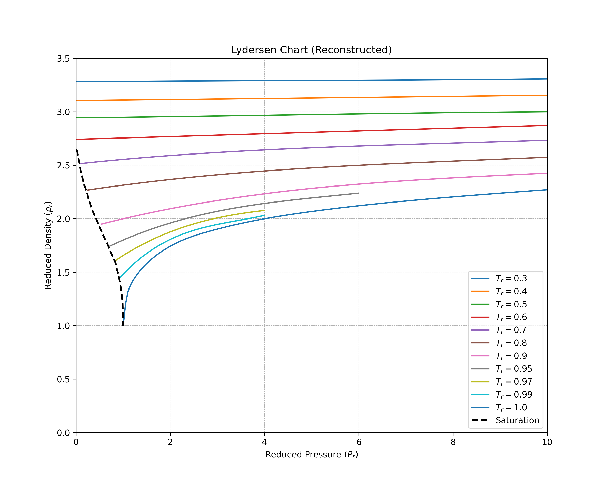
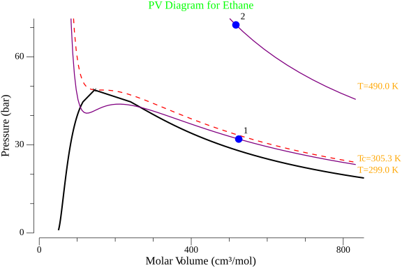

# zfactor

`zfactor` is a comprehensive Go library designed for thermodynamic property calculations and visualization. It provides tools for solving Cubic Equations of State (EOS), estimating properties using correlations like Lee-Kesler, and generating Pressure-Volume (PV) diagrams.

## Features

- **Cubic Equations of State (EOS)**: Support for major cubic EOS models:
  - van der Waals (vdW)
  - Redlich-Kwong (RK)
  - Soave-Redlich-Kwong (SRK)
  - Peng-Robinson (PR)
- **Lee-Kesler Correlation**: Accurate estimation of compressibility factors (Z) and other derived properties.
- **Virial Equations**: Solvers for 2-term and 3-term virial equations of state.
- **Abbott Correlations**: Generalized correlations for the second virial coefficient ($B$).
- **Liquid Properties**: Calculation of saturated liquid molar volumes using the Rackett equation and reduced density using Lydersen charts.
- **Antoine Equation**: Calculation of saturation vapor pressures.
- **Thermodynamic State Management**: Easy definition and validation of states ($T, P$).
- **Heat Capacity Data**: Constants for Ideal Gases, Liquids, and Solids.
- **Visualization**: Built-in generation of PV diagrams with:
  - Critical Isotherms
  - Saturation Domes (Two-phase regions)
  - Custom Isotherms
  - Customizable styling (colors, labels, dimensions)
- **Substance Database**: Pre-defined properties for common substances (Critical properties, Acentric factor, MW, etc.).

## Important Note on Lydersen Charts

> The `ReducedDensity` function relies on digitized data from the Lydersen charts. While efforts have been made to ensure accuracy through smoothing and normalization, users should exercise caution.

- **Verification**: Please review the generated [Lydersen Chart Plot](images/lydersen_plot.png) to ensure the curves meet the precision requirements of your specific use case.
- **Updates**: Data values may be refined in future versions as digitization techniques improve or better data sources are integrated.



## Installation

```bash
go get github.com/rickykimani/zfactor
```

## Usage

`zfactor` uses a unified argument structure `zfactor.Args` for most functions to ensure clarity and type safety.

**Standard Units** (unless otherwise customized or specified):
- **Temperature**: Kelvin (K)
- **Pressure**: bar
- **Volume**: cm³/mol
- **Gas Constant (R)**: typically `bar·cm³/(mol·K)` (available as `zfactor.RSI * 10`)

### 1. General Property Calculation (Cubic EOS & Lee-Kesler)

Compare molar volume estimates using the Lee-Kesler correlation vs. the Soave-Redlich-Kwong (SRK) Equation of State.

For a full runnable example, see [examples/problem_ethane_cylinder/main.go](examples/problem_ethane_cylinder/main.go).

```go
package main

import (
	"fmt"
	"log"

	"github.com/rickykimani/zfactor"
	"github.com/rickykimani/zfactor/cubic"
	leekesler "github.com/rickykimani/zfactor/lee-kesler"
	"github.com/rickykimani/zfactor/substance"
)

func main() {
	ethane := substance.Ethane
	args := zfactor.Args{
		T: 299.0, // Kelvin
		P: 32.0,  // bar
		R: 10 * zfactor.RSI, // bar*cm³/(mol*K)
	}

	// 1. Estimate Z using Lee-Kesler
	z, err := ethane.LeeKesler(args, leekesler.CompressibilityFactor)
	if err != nil {
		log.Fatal(err)
	}
	
	v_lk := z * args.R * args.T / args.P
	fmt.Printf("Volume (Lee-Kesler): %.2f cm³/mol\n", v_lk)

	// 2. Solve using SRK Equation of State
	// Create configuration for SRK
	cfg := ethane.CubicConfig(&cubic.SRK{}, args)
	
	// Solve for Volume (returns roots for liquid/vapor)
	volRes, err := cubic.SolveForVolume(cfg)
	if err != nil {
		log.Fatal(err)
	}
	
	fmt.Printf("Volume (SRK): %v\n", volRes.Clean())
}
```

### 2. Virial Equations

Solve for compressibility factors using 2-term or 3-term virial equations.

For a full runnable example, see [examples/virial/main.go](examples/virial/main.go).

```go
import "github.com/rickykimani/zfactor/virial"

// Isopropanol vapor example
args := zfactor.Args{
    T: 473.15, // K
    P: 10.0,   // bar
    R: 83.14,  // bar·cm³/(mol·K)
    B: -338.0, // Second virial coefficient (cm³/mol)
    C: -26000.0, // Third virial coefficient (cm⁶/mol²)
}

// 2-Term Virial (Z = 1 + BP/RT)
z2, _ := virial.CompressibilityTwoTerm(args)
fmt.Printf("Z (2-term): %.4f\n", z2)

// 3-Term Virial (Iterative solution)
// Returns complex roots for volume
roots, _ := virial.SolveForVolumeThreeTerm(args)
```

### 3. Saturation & Liquid Properties

For a full runnable example, see [examples/liquids/main.go](examples/liquids/main.go).

Calculate saturation pressure (Antoine) and liquid molar properties (Rackett/Lydersen).

```go
import (
    "github.com/rickykimani/zfactor/antoine"
    "github.com/rickykimani/zfactor/substance"
)

// Saturation Pressure (Antoine Equation)
// Note: Antoine coefficients often use Celsius and specific pressure units (e.g., kPa)
pSat, _ := antoine.Ethanol.Pressure(25.0) // 25°C
fmt.Printf("Saturation Pressure (Ethanol @ 25C): %.2f kPa\n", pSat)

// Saturated Liquid Volume (Rackett Equation)
eth := substance.Ethane
vSat, _ := eth.Vsat(299.0) // T in Kelvin required
fmt.Printf("Saturated Liquid Volume: %.4f cm³/mol\n", vSat)

// Reduced Density (Lydersen Charts)
rhoR, _ := eth.ReducedDensity(zfactor.Args{T: 299.0, P: 50.0})
fmt.Printf("Reduced Density: %.4f\n", rhoR)
```

### 4. Residual Properties (Abbott/Virial & Lee-Kesler)

Calculate residual enthalpy ($H^R$) and entropy ($S^R$). You can use either the Abbott correlations (based on Virial coefficients) or the Lee-Kesler tables. Lee-Kesler is generally more accurate at higher pressures.

For a full runnable example, see [examples/residual/main.go](examples/residual/main.go).

```go
import (
    leekesler "github.com/rickykimani/zfactor/lee-kesler"
    "github.com/rickykimani/zfactor/substance"
)

eth := substance.Ethane
args := zfactor.Args{T: 299.0, P: 32.0}

// 1. Abbott Correlations (Virial)
hR, _ := eth.ResidualEnthalpy(args)
sR, _ := eth.ResidualEntropy(args)

// 2. Lee-Kesler (More accurate at high pressure)
hR_LK, _ := eth.LeeKesler(args, leekesler.ResidualEnthalpy)
sR_LK, _ := eth.LeeKesler(args, leekesler.ResidualEntropy)
```

### 5. Mixture Properties

Estimate properties for gas mixtures using Kay's Rule (linear pseudo-critical properties) and Lee-Kesler correlations.

For a full runnable example, see [examples/problem_mixture/main.go](examples/problem_mixture/main.go).

```go
// Define an equimolar mixture of CO2 and Propane
mixture, _ := substance.NewLinearMixture("Mixture", []substance.Component{
    {Substance: substance.CarbonDioxide, Fraction: 0.5},
    {Substance: substance.Propane, Fraction: 0.5},
})

// Use the mixture just like a pure substance
args := zfactor.Args{T: 450, P: 140}
z, _ := mixture.LeeKesler(args, leekesler.CompressibilityFactor)
```

### 6. Generating a PV Diagram

Visualize thermodynamic states on a PV diagram, including the saturation dome and critical isotherm.

```go
package main

import (
	"log"

	"github.com/rickykimani/zfactor/cubic"
	"github.com/rickykimani/zfactor/state"
	"github.com/rickykimani/zfactor/substance"
)

func main() {
	// Define states
	s1, _ := state.NewState(substance.Ethane, 299, 32)
	s2, _ := state.NewState(substance.Ethane, 490, 70)

	// Configure the plot
	cfg := &state.PVConfig{
		Type:           *cubic.PR{}, // Use Peng-Robinson
		Title:          "PV Diagram for Ethane",
		NumberStates:   true,
		LabelIsotherms: true,
	}

	// Generate the diagram
	err := state.DrawPV(cfg, "ethane_pv.png", s1, s2)
	if err != nil {
		log.Fatal(err)
	}
}
```
### Example Output

The following diagram was generated using the code in [examples/main.go](examples/main.go):



### 7. Heat Capacity Data (cp)

The `cp` package provides standard heat capacity constants ($A, B, C, D$) for gases (Ideal Gas state), liquids, and solids. It supports the standard polynomial form:

$$ \frac{C_P}{R} = A + BT + CT^2 + DT^{-2} $$


> [!NOTE]
> This package currently serves as a data repository. Calculation methods for heat capacity values, enthalpy/entropy integrals are pending implementation

Data is available via pre-defined variables:
- `cp.MethaneGas`
- `cp.WaterLiquid`
- `cp.CaOSolid`
etc.


## Package Overview

- **`zfactor`**: Root package, defines `Args` and physical constants.
- **`substance`**: Database of chemical species and methods for substance-specific calculations (e.g., `Ethane.LeeKesler(...)`).
- **`cubic`**: Solvers for cubic equations of state (vdW, RK, SRK, PR) for Volume, Pressure, and Z.
- **`lee-kesler`**: Implementation of the Lee-Kesler generalized correlation tables.
- **`virial`**: Solvers for 2-term and 3-term virial equations.
- **`abbott`**: Generalized correlations for second virial coefficient ($B$) and residual properties.
- **`antoine`**: Antoine equation parameters and solvers for saturation pressure.
- **`cp`**: Heat capacity constants for gases, liquids, and solids (Data only; calculation logic pending).
- **`liquids`**: Correlations for liquid density (Raackett, Lydersen).
- **`state`**: High-level plotting logic for generating Thermodynamic PV diagrams.

## License

This project is licensed under the MIT License - see the [LICENSE](LICENSE) file for details.
