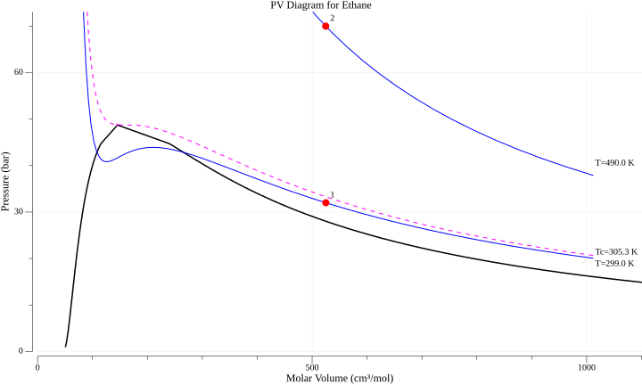
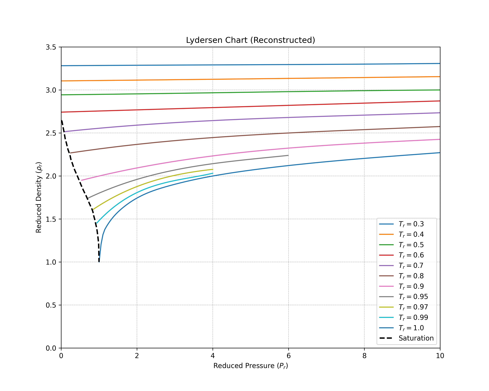

# zfactor

**Chemical engineering thermodynamics in Go.** Equations of state, generalized
correlations, vapor–liquid equilibrium, and the property data to drive them,
in one dependency-light module.

[](https://pkg.go.dev/github.com/rickykimani/zfactor)
[](https://go.dev/dl/)
[](LICENSE)

Most of what a thermodynamics course asks you to do by hand, whether that is
reading a chart, interpolating a table, iterating a cubic or guessing a bubble
temperature, this library does directly, and against numbers you can check.
Where the textbook works an example, the test suite is pinned to it: results
across most packages are checked against Smith, Van Ness & Abbott,
*Introduction to Chemical Engineering Thermodynamics* (9th ed.). Where it does
not, they are held to identities the implementation cannot fake: a root against
its own polynomial, a closed form against its limiting case, a constant against
its definition.

```go
// Flash a three-component feed at 80 °C and 110 kPa (Example 13.8).
result, _ := raoult.FlashPT(raoult.MixtureInput{
	T:            80,
	P:            110,
	Compositions: []float64{0.45, 0.35, 0.20},
	Antoine: []antoine.Model{
		antoine.Acetone, antoine.Acetonitrile, antoine.Nitromethane,
	},
})

fmt.Printf("%.4f of the feed is vapor\n", result.V) // 0.7365, book: 0.7364
```

## What it does

| Area | What you get |
| --- | --- |
| **Cubic equations of state** | van der Waals, Redlich–Kwong, Soave–RK, Peng–Robinson. Volume, pressure and Z, saturation pressure by equal fugacity, and the departure properties: residual *H* and *S*, and the fugacity coefficient. |
| **Generalized correlations** | Lee–Kesler tables (Z, residual *H* and *S*, fugacity coefficient) and the Abbott correlations for the second virial coefficient. |
| **Virial equations** | Two-term (pressure series) and three-term (Leiden/density series) truncations. |
| **Vapor–liquid equilibrium** | Bubble and dew point in both *P* and *T*, under Raoult's law or the modified law with activity coefficients. |
| **Activity models** | Margules, Van Laar, Wilson and NRTL, with infinite-dilution limits. |
| **Flash calculations** | Isothermal *P,T*-flash by Rachford–Rice, with feeds outside the two-phase region reported rather than silently mangled. |
| **Azeotropes** | Located at fixed *T* or fixed *P*, including double azeotropes, which an endpoint test would miss entirely. |
| **Pure-component data** | Critical properties, acentric factors, Antoine constants, and heat capacities for gases, liquids and solids, transcribed from the appendices and code-generated. |
| **Liquid properties** | Rackett saturated volumes and reduced density from digitized Lydersen charts. |
| **Linear algebra** | `linalglite`: a small, allocation-conscious dense LU solver with no dependencies. |
| **Visualization** | PV diagrams with saturation domes, critical isotherms, themes and palettes. |

## Installation

```bash
go get github.com/rickykimani/zfactor
```

## Conventions

Most functions take a single `zfactor.Args` struct rather than a long positional
signature, so the units a call assumes are visible at the call site.

| Quantity | Unit |
| --- | --- |
| Temperature | K, **except** Antoine and VLE, which use °C |
| Pressure | bar, **except** Antoine and VLE, which use kPa |
| Volume | cm³/mol |
| Gas constant | `10 * zfactor.RSI`, i.e. bar·cm³/(mol·K) |

The temperature split is deliberate: the Antoine constants in the appendices are
tabulated for °C, and rather than convert them and lose the ability to check a
value against the printed table, the VLE layer works in the units its data came
in. Where a kelvin temperature must meet an Antoine model, the conversion is
absorbed into the constant `C`, leaving `A` and `B` as printed.

---

## Usage

### 1. Volumetric properties: cubic EOS and Lee–Kesler

Compare the molar volume of ethane from a generalized correlation against a
cubic equation of state.

Full example: [examples/problem_ethane_cylinder/main.go](examples/problem_ethane_cylinder/main.go)

```go
package main

import (
	"fmt"
	"log"

	"github.com/rickykimani/zfactor"
	"github.com/rickykimani/zfactor/cubic"
	leekesler "github.com/rickykimani/zfactor/lee-kesler"
	"github.com/rickykimani/zfactor/substance"
)

func main() {
	ethane := substance.Ethane
	args := zfactor.Args{
		T: 299.0,            // K
		P: 32.0,             // bar
		R: 10 * zfactor.RSI, // bar·cm³/(mol·K)
	}

	// Lee–Kesler: Z interpolated from the tabulated correlation.
	z, err := ethane.LeeKesler(args, leekesler.CompressibilityFactor)
	if err != nil {
		log.Fatal(err)
	}

	fmt.Printf("Volume (Lee-Kesler): %.2f cm³/mol\n", z*args.R*args.T/args.P)

	// Soave–Redlich–Kwong: a cubic, so up to three roots.
	volumes, err := cubic.SolveForVolume(ethane.CubicConfig(&cubic.SRK{}, args))
	if err != nil {
		log.Fatal(err)
	}

	// Clean discards the complex pair, leaving the physical roots.
	fmt.Printf("Volume (SRK): %v\n", volumes.Clean())
}
```

The available properties are `leekesler.CompressibilityFactor`,
`ResidualEnthalpy`, `ResidualEntropy` and `FugacityCoefficient`. Each carries
its own pair of tables and the rule for combining them with the acentric
factor, so adding one does not mean touching a switch statement.

### 2. Virial equations

Full example: [examples/virial/main.go](examples/virial/main.go)

```go
import "github.com/rickykimani/zfactor/virial"

// Isopropanol vapor at 200 °C, Example 3.8.
args := zfactor.Args{
	T: 473.15,   // K
	P: 10.0,     // bar
	R: 83.14,    // bar·cm³/(mol·K)
	B: -388.0,   // second virial coefficient, cm³/mol
	C: -26000.0, // third virial coefficient, cm⁶/mol²
}

// Two-term: Z = 1 + BP/RT. Linear in pressure, and refuses above 15 bar
// rather than return a number the truncation does not support.
z2, _ := virial.CompressibilityTwoTerm(args)

// Three-term: a cubic in volume, so all three roots come back.
roots, _ := virial.SolveForVolumeThreeTerm(args)
```

Don't have coefficients? The `abbott` package estimates *B* from the reduced
temperature and acentric factor.

### 3. Saturation and liquid properties

Full example: [examples/liquids/main.go](examples/liquids/main.go)

```go
import (
	"github.com/rickykimani/zfactor/antoine"
	"github.com/rickykimani/zfactor/substance"
)

// Antoine: °C in, kPa out.
pSat, _ := antoine.Ethanol.Pressure(25.0)

// And the inverse: the temperature at which a pressure is reached.
tSat, _ := antoine.Ethanol.Temperature(101.325)

// Rackett saturated liquid volume, and reduced density from the
// Lydersen charts. These take kelvin.
eth := substance.Ethane
vSat, _ := eth.Vsat(299.0)
rhoR, _ := eth.ReducedDensity(zfactor.Args{T: 299.0, P: 50.0})
```

Outside a correlation's fitted range you get **both** a value and a
`*zfactor.RangeError`. The number is the extrapolation, so a caller who knows
what they are doing can use it; one who does not has to acknowledge the error to
reach it. Test with `errors.As`.

### 4. Residual properties

Departures from ideal-gas behaviour, by three routes: the Abbott correlations,
the Lee–Kesler tables, or a cubic equation of state. Abbott is a second-virial
correlation and so is limited to modest pressures; Lee–Kesler is tabulated data
and reads well across the range; the equation of state carries no tables at all
and gives a liquid as readily as a vapor.

All three return the same dimensionless groups, *H*ᴿ/(*R T*c) and *S*ᴿ/*R*, so
they can be compared directly.

Full example: [examples/residual/main.go](examples/residual/main.go)

```go
import (
	"github.com/rickykimani/zfactor/cubic"
	leekesler "github.com/rickykimani/zfactor/lee-kesler"
	"github.com/rickykimani/zfactor/substance"
)

eth := substance.Ethane
args := zfactor.Args{T: 299.0, P: 32.0}

hR, _ := eth.AbbottResidualEnthalpy(args)
sR, _ := eth.AbbottResidualEntropy(args)

hrLK, _ := eth.LeeKesler(args, leekesler.ResidualEnthalpy)
srLK, _ := eth.LeeKesler(args, leekesler.ResidualEntropy)
```

From an equation of state, the state has to be solved before a departure can be
evaluated, so the gas constant is needed and the phase is named. A subcritical
state has a liquid root and a vapor root with a different residual property
apiece; `cubic.StablePhase` picks whichever one actually exists, by comparing
their fugacities.

```go
butane := substance.NButane
srk := &cubic.SRK{}

// R in bar·cm³/(mol·K), matching the pressure unit.
state := zfactor.Args{T: 500.0, P: 50.0, R: zfactor.RSI * 10}

hrEOS, _ := butane.CubicResidualEnthalpy(srk, cubic.StablePhase, state)
srEOS, _ := butane.CubicResidualEntropy(srk, cubic.StablePhase, state)

// The residual Gibbs energy, which ties the other two together:
// ln φ = Hᴿ/RT − Sᴿ/R.
lnPhi, _ := butane.CubicLogFugacity(srk, cubic.StablePhase, state)
```

Naming `cubic.LiquidPhase` or `cubic.VaporPhase` instead asks for that root
whether or not it is the stable one, which is what a flash loop wants and what
makes the metastable region reachable.

### 5. Mixtures

Kay's rule gives pseudo-critical properties, and the result behaves like any
other substance.

Full example: [examples/problem_mixture/main.go](examples/problem_mixture/main.go)

```go
mixture, _ := substance.NewLinearMixture("Mixture", []substance.Component{
	{Substance: substance.CarbonDioxide, Fraction: 0.5},
	{Substance: substance.Propane, Fraction: 0.5},
})

args := zfactor.Args{T: 450, P: 140}
z, _ := mixture.LeeKesler(args, leekesler.CompressibilityFactor)
```

### 6. Bubble and dew points

Full example: [examples/bubble/main.go](examples/bubble/main.go)

```go
import (
	"github.com/rickykimani/zfactor/antoine"
	"github.com/rickykimani/zfactor/vle/raoult"
)

feed := raoult.MixtureInput{
	T:            100,    // °C
	P:            101.33, // kPa
	Compositions: []float64{0.30, 0.70},
	Antoine:      []antoine.Model{antoine.Benzene, antoine.Toluene},
}

bp, _ := raoult.BubbleP(feed) // bp.P, bp.Y
bt, _ := raoult.BubbleT(feed) // bt.T, bt.Y
dp, _ := raoult.DewP(feed)
dt, _ := raoult.DewT(feed)
```

`BubbleP` is explicit; `BubbleT` and the dew-point calculations are iterative,
since the saturation pressures depend on the temperature being solved for.

### 7. Non-ideal liquids: activity models

For a liquid that is nowhere near ideal, swap `raoult` for `modified-raoult`
and supply an activity model. The rest of the API is unchanged.

```go
import (
	modified_raoult "github.com/rickykimani/zfactor/vle/modified-raoult"
)

// Wilson's interaction parameters are usually tabulated in cal/mol,
// and the model wants J/mol.
const calToJ = 4.186

nonIdeal := modified_raoult.MixtureInput{
	P:            101.33,
	Compositions: []float64{0.30, 0.70},
	Antoine:      []antoine.Model{antoine.Acetone, antoine.Water},
	Activity: modified_raoult.Wilson{
		V: []float64{74.05, 18.07}, // molar volumes, cm³/mol
		Interaction: [][]float64{
			{0, 291.27 * calToJ},
			{1448.01 * calToJ, 0},
		},
	},
}

bt, _ := modified_raoult.BubbleT(nonIdeal)
dt, _ := modified_raoult.DewT(nonIdeal)
```

`Margules`, `VanLaar`, `Wilson` and `NRTL` are all accepted. The underlying
`activity` package also exposes `InfiniteDilution`, for the limiting
coefficients as a component becomes trace. Every model is held to the
Gibbs–Duhem equation in the test suite, which is what caught an incorrect NRTL
limit that agreed with the numerical path to within a factor of three.

### 8. Azeotropes

Full example: [examples/azeotrope/main.go](examples/azeotrope/main.go)

```go
found, err := modified_raoult.AzeotropeP(modified_raoult.MixtureInput{
	T:        45, // °C
	Antoine:  []antoine.Model{methanol, methylAcetate},
	Activity: modified_raoult.Margules{A12: 1.107, A21: 1.107},
})

if errors.Is(err, modified_raoult.ErrNoAzeotrope) {
	// The common outcome, and reported as a sentinel rather than an
	// empty slice, so "none exists" is distinct from "did not converge".
}

for _, a := range found {
	fmt.Printf("x1 = y1 = %.4f at %.2f kPa\n", a.X[0], a.P)
}
```

The result is a **slice** because a binary can form more than one azeotrope.
That is also why the search sweeps the composition range instead of comparing
the two pure limits: with an even number of azeotropes the residual has the
same sign at both ends, and an endpoint test finds nothing at all.

### 9. Flash calculations

Given a feed at a temperature and pressure, how much of it is vapor, and what
is in each phase?

Full example: [examples/flash/main.go](examples/flash/main.go)

```go
import "github.com/rickykimani/zfactor/vle/raoult"

result, err := raoult.FlashPT(raoult.MixtureInput{
	T:            80,  // °C
	P:            110, // kPa
	Compositions: []float64{0.45, 0.35, 0.20},
	Antoine: []antoine.Model{
		antoine.Acetone, antoine.Acetonitrile, antoine.Nitromethane,
	},
})

// A feed that is not actually two-phase is a different answer rather
// than an error in the solve, so it is reported as one.
var single *vle.SinglePhaseError
if errors.As(err, &single) {
	fmt.Println("feed is single-phase:", single.State)
}

fmt.Printf("V = %.4f  x = %v  y = %v\n", result.V, result.X, result.Y)
```

Running it reproduces Example 13.8 to every digit the book prints:

```
  vapor  0.7365 mol   liquid 0.2635 mol

  species          x        y
  acetone        0.2859   0.5087
  acetonitrile   0.3810   0.3389
  nitromethane   0.3331   0.1524

  the book gives V = 0.7364, x = 0.2859/0.3810/0.3331,
                          y = 0.5087/0.3389/0.1524
```

Solved by Rachford–Rice in the difference form, whose poles all lie outside
[0, 1] for positive *K*, which is what makes bisection safe here.

### 10. Heat capacity

Constants *A, B, C, D* for ideal gases, liquids and solids, in the standard form

$$\frac{C_P}{R} = A + BT + CT^2 + DT^{-2}$$

```go
import "github.com/rickykimani/zfactor/cp"

gas := cp.MethaneGas
s1 := zfactor.Args{T: 300, P: 100000, R: zfactor.RSI}
s2 := zfactor.Args{T: 1000, P: 100000, R: zfactor.RSI}

dH, _ := gas.IdealGasEnthalpyChange(s1, s2)
dS, _ := gas.IdealGasEntropyChange(s1, s2)
```

Data is exposed as package-level variables: `cp.MethaneGas`,
`cp.WaterLiquid`, `cp.CaOSolid`, and so on.

### 11. Vapor pressure and acentric factor

```go
import leekesler "github.com/rickykimani/zfactor/lee-kesler"

// Via a substance, if it has a normal boiling point defined.
methane := substance.Methane
pSat, _ := methane.LeeKeslerVaporPressure(150.0) // K in, bar out
omega, _ := methane.LeeKeslerAcentric()

// Or directly, from (T, Tn, Tc, Pc).
pSat2, _ := leekesler.VaporPressure(150.0, 111.6, 190.6, 46.1)
```

### 12. PV diagrams

Full example: [examples/pvdiagram/main.go](examples/pvdiagram/main.go)

```go
package main

import (
	"log"

	"github.com/rickykimani/zfactor/cubic"
	"github.com/rickykimani/zfactor/state"
	"github.com/rickykimani/zfactor/state/themes"
	"github.com/rickykimani/zfactor/substance"
)

func main() {
	first, err := state.NewState(substance.Ethane, 299, 32)
	if err != nil {
		log.Fatal(err)
	}

	second, err := state.NewState(substance.Ethane, 490, 70)
	if err != nil {
		log.Fatal(err)
	}

	cfg := &state.PVConfig{
		Type:           &cubic.PR{}, // the EOS the dome is drawn from
		Title:          "PV Diagram for Ethane",
		NumberStates:   true,
		LabelIsotherms: true,
		Theme:          themes.DarkTheme(),
		Width:          10 * state.Inch, // defaults to 6 x 4 inches
		Height:         6 * state.Inch,
	}

	// The extension picks the format; an unsupported one is refused with
	// the nearest supported spelling suggested.
	if err := state.DrawPV(cfg, "ethane_pv.svg", first, second); err != nil {
		log.Fatal(err)
	}
}
```

Every state on one diagram must be the same substance: the axes are scaled from
its critical properties and the dome is drawn from its equation of state. Both
images below are produced by
[the example](examples/pvdiagram/main.go), one per theme, so they cannot drift
from the code that draws them.

<picture>
  <source media="(prefers-color-scheme: dark)" srcset="images/ethane_pv_dark.svg">
  
</picture>

### 13. Linear algebra: `linalglite`

A small dense LU solver, written for the inner loop of an equilibrium or
reaction calculation where the same small system is solved repeatedly. It
imports nothing else in the module.

Full example: [examples/linalglite/main.go](examples/linalglite/main.go)

```go
import "github.com/rickykimani/zfactor/linalglite"

a := linalglite.NewFrom(3, 3, []float64{
	1, 1, 1,
	2, -1, 0,
	0, 3, -1,
})

x, _ := linalglite.Solve(a, []float64{100, 0, 0})

// The check that matters on a solution is whether it satisfies the
// equations, not how it was reached.
residual, _ := linalglite.Residual(a, x, []float64{100, 0, 0})
```

For a Newton iteration, keep the factorisation and replace it in place.
`Refactorize` and `SolveInto` reuse the caller's storage, so the loop allocates
nothing however many steps it takes. Orders up to three use closed forms rather
than elimination. A singular matrix is reported as `ErrSingular` rather than
divided by to produce infinities that look like numbers.

---

## A note on the Lydersen charts

> `ReducedDensity` relies on data digitized from the Lydersen charts. Effort has
> gone into smoothing and normalizing it, but it is traced from a chart, not
> tabulated.

Review the [plotted result](images/lydersen_plot.png) against the precision your
application needs. These values may be refined as digitization improves or
better sources are found.



## Package overview

| Package | Contents |
| --- | --- |
| `zfactor` | `Args`, physical constants, the shared `RangeError`. |
| `substance` | 87 species with critical properties, plus substance-level methods (`Ethane.LeeKesler(…)`). |
| `cubic` | vdW, RK, SRK, PR. Volume, pressure, Z, saturation pressure, residual *H* and *S*, fugacity coefficient, and phase selection among the roots. |
| `lee-kesler` | The generalized correlation tables and interpolation. |
| `virial` | Two- and three-term virial equations. |
| `abbott` | Generalized second virial coefficient and residual properties. |
| `antoine` | 42 substances' Antoine constants, forward and inverse. |
| `cp` | Heat capacity data and ideal-gas ΔH, ΔS. |
| `liquids` | Rackett and Lydersen correlations. |
| `vle` | Shared VLE types: solver options, phase states, errors. |
| `vle/raoult` | Ideal VLE: bubble, dew, flash. |
| `vle/modified-raoult` | VLE with activity coefficients, plus azeotropes. |
| `activity` | Margules, Van Laar, Wilson, NRTL; infinite-dilution limits. |
| `linalglite` | Dense LU, standalone and dependency-free. |
| `state` | PV diagrams, with `state/themes` and `state/palettes`. |

## Roadmap

Not implemented yet. Listed roughly in the order they are likely to land.

- [ ] **Third virial coefficient correlations.** Pitzer-style *C*⁰ and *C*¹,
      e.g. Orbey–Vera, so the three-term form no longer needs *C* supplied.
- [ ] **Raw PVT data.** Fit and interpolate measured data instead of relying
      solely on correlations.
- [ ] **Partial molar properties.**
- [ ] **Poynting correction**, for VLE at pressures where the liquid's
      compressibility stops being negligible.
- [ ] **Henry's law**, for dissolved gases well above their critical
      temperature, where the modified Raoult treatment does not apply.
- [ ] **VLE data reduction.** Fitting activity model parameters to measured
      *P–x–y* data, the inverse of what section 7 does.
- [ ] **UNIFAC and UNIQUAC.** Group-contribution and lattice activity models,
      for mixtures with no fitted parameters available.
- [ ] **More cubic equations of state:** PRSV1/2, PRBS, ESD, CPA, CPC.
- [ ] **Chemical reaction equilibria.** Equilibrium constants and conversion.
- [ ] **Azeotropes for arbitrary numbers of species.** The present search is
      binary; the general case is a multidimensional root find, which is part of
      why `linalglite` exists.

## Development

Tasks are collected in a [justfile](justfile). The recipes are written for
[nushell](https://www.nushell.sh/), so `just` and `nu` both need to be on PATH.

```bash
just
```

lists everything. The ones worth knowing:

| Recipe | Does |
| --- | --- |
| `just check` | gofmt, vet, the full suite, and builds every example. Run before committing. |
| `just test` | The suite. `just test-pkg cubic` for one package, `just test-run Azeotrope` by name. |
| `just cover` | Statement coverage per package; `just cover-gaps cubic` lists only what is under 100%. |
| `just examples` | Runs all eleven examples, so a stale one cannot pass unnoticed. |
| `just generate` | Regenerates the data tables from the JSON under `data/`. Deterministic. |
| `just doc` | Serves the package documentation locally. |

The tables in `cp`, `antoine`, `substance`, `lee-kesler` and `liquids` are
generated, not hand-written: the JSON under `data/` is parsed from the book's
appendices and turned into Go by `go generate`. The extracted page ranges are
kept in `data/` so a parsing bug can be traced to its source.

## On the use of AI

Large language models were used in the development of this project, primarily
for:

- **finding and fixing bugs**, including several genuine defects in the
  numerical code: a broken cube-root coupling in the cubic solver, a transposed
  digit in an equation-of-state constant, and column-shifted rows in the table
  parsers;
- **optimizations**;
- **writing tests from known problems with published solutions**, which is
  where most of the test suite's worked examples come from; and
- **documentation**, including this README and much of the package and example
  commentary.

The physics, the scope and the design decisions are the author's. So is the
verification strategy described at the top: a test here is written to check a
result against something independent of the code that produced it, rather than
against whatever value the implementation happened to return. That is the
discipline that made the bug-finding above worth anything.

## License

MIT. See [LICENSE](LICENSE).
